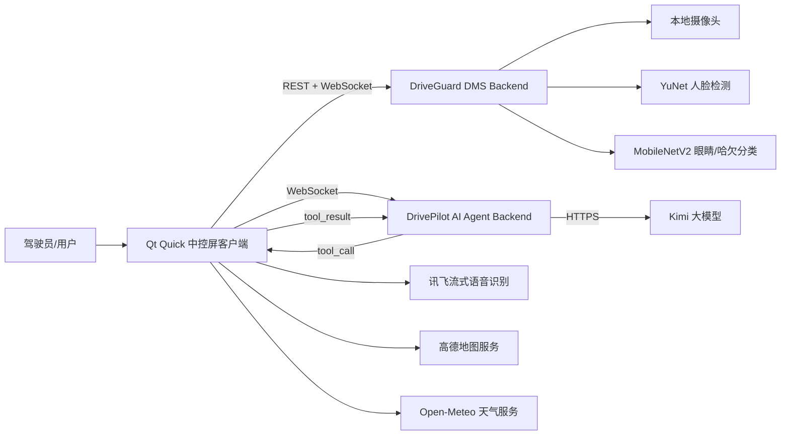

# DrivePilot Cockpit

> Qt Quick 智能座舱模拟系统：集成车机 HMI、驾驶员疲劳监测（DMS）与可执行车控工具的 AI Agent。

DrivePilot Cockpit 是一个面向 Qt 实习、课程设计和毕业设计展示的三端一体化项目。项目使用 **Qt Quick/QML + C++** 构建中控屏客户端，使用 **FastAPI + OpenCV + ONNX Runtime** 构建后台疲劳监测服务，并使用 **FastAPI + WebSocket + Kimi Tool Calling** 构建可边分析、边调用车机工具、边反馈执行结果的 AI Agent。

> 本项目是教学与作品集用途的模拟系统，不连接真实车辆 CAN 总线，也不具备量产车规或安全认证能力。

<p align="center">
  
</p>


## 系统组成



| 子项目 | 技术栈 | 主要职责 |
|---|---|---|
| [`hmi-client`](hmi-client/) | Qt 6、QML、C++、CMake、WebEngine、WebSocket、SQLite | 中控 UI、空调/音乐/导航/天气/联系人/视频/画图/AI 助手、DMS 状态展示与语音提醒 |
| [`dms-backend`](dms-backend/) | Python、FastAPI、OpenCV、YuNet、MobileNetV2、ONNX Runtime | 摄像头后台推理、闭眼/哈欠识别、PERCLOS、四级疲劳状态机 |
| [`agent-backend`](agent-backend/) | Python、FastAPI、WebSocket、Kimi Tool Calling | 多轮 Agent 循环、工具编排、会话状态、密钥隔离、执行轨迹输出 |

## 界面展示

<table>
  <tr>
    <td width="50%"><br><b>Codex 风格 AI Agent</b></td>
    <td width="50%"><br><b>天气详情与本地天气图标</b></td>
  </tr>
  <tr>
    <td width="50%"><br><b>高德地图导航</b></td>
    <td width="50%"><br><b>智能空调控制</b></td>
  </tr>
</table>

更多页面截图见 [完整界面画廊](docs/12-interface-gallery.md)。

## 核心功能

### Qt 智能座舱

- 固定设计画布与窗口等比适配；
- 首页、应用中心、空调、控制中心、车辆设置和车辆健康；
- 本地音乐播放、媒体导入与播放状态管理；
- 天气查询、国内行政区搜索与定位，本地 PNG 天气图标避免 Emoji 字体渲染不稳定；
- 高德地图导航、路线步骤与地图交互；
- 联系人、通话记录、拨号模拟与 SQLite 持久化；
- 视频中心、科学计算器与 Vector Studio；
- 讯飞 WebSocket 流式语音识别；
- 全局 Toast、状态栏、偏好设置持久化；
- 疲劳状态图标、告警弹窗与本地 TTS 语音提醒；
- Codex 风格 AI Agent：展示分析摘要、计划、工具调用、执行结果和最终回复。

### DMS 疲劳监测

- YuNet 人脸与五点关键点检测；
- MobileNetV2 双模型：`Closed/Open` 与 `yawn/no_yawn`；
- ONNX Runtime CPU 推理；
- 连续闭眼时长、PERCLOS、哈欠事件去重；
- 活力、正常、略微疲劳、严重疲劳四级状态；
- 状态升级/恢复防抖、告警冷却；
- 摄像头画面只在 Python 进程内部处理，不向 Qt 返回视频流。

### AI Agent

- Qt 与 FastAPI 通过 WebSocket 保持会话；
- Kimi 负责理解请求和选择工具；
- Qt 负责参数校验并执行实际模拟车控；
- 工具执行结果回传模型，模型决定继续执行或完成回复；
- 工具白名单、超时保护、最大步数限制；
- 无 Kimi Key 时提供本地演示模式，便于离线验证完整链路。

## 快速启动

### 1. 启动 DMS 后端

```powershell
cd dms-backend
py -3.11 -m venv .venv
.\.venv\Scripts\Activate.ps1
pip install -r requirements-stage5.txt
python scripts/16_run_server.py
```

DMS 默认监听：

```text
http://127.0.0.1:8765
```

训练数据、训练产物和 ONNX 文件不会提交到仓库。请先按照 [`dms-backend/README.md`](dms-backend/README.md) 放置或训练所需模型。

### 2. 启动 AI Agent 后端

```powershell
cd agent-backend
py -3.11 -m venv .venv
.\.venv\Scripts\Activate.ps1
pip install -r requirements-dev.txt
Copy-Item .env.example .env
python scripts/run_server.py
```

Agent 默认监听：

```text
http://127.0.0.1:8770
ws://127.0.0.1:8770/ws/agent/{session_id}
```

未配置 Kimi Key 时自动使用本地演示模式。

### 3. 配置并运行 Qt

```powershell
cd hmi-client
Copy-Item config.example.json config.json
```

填写讯飞和高德凭据后，用 Qt Creator 或 CLion 打开 `CMakeLists.txt`，选择 Qt 6.9.1 套件并编译运行。

详细步骤见：

- [部署与运行](docs/06-deployment-guide.md)
- [用户使用说明](docs/07-user-guide.md)

## 已验证结果

公共测试集上的实测结果：

| 模型 | 测试集 Macro F1 | 校准阈值结果 | ONNX CPU P95 |
|---|---:|---:|---:|
| 眼睛状态 MobileNetV2 | 0.9908 | Closed 阈值 0.43，F1 0.9862 | 3.120 ms |
| 哈欠状态 MobileNetV2 | 0.9814 | yawn 阈值 0.62，F1 0.9907 | 4.032 ms |

ONNX 与 PyTorch 输出最大绝对误差分别为 `4.5e-7` 和 `3.6e-7`。

> 上述结果来自数据集测试环境，不能等同于真实驾驶场景准确率。光照、眼镜、姿态、摄像头位置和个体差异都可能造成域偏移。

## 仓库目录

```text
DrivePilot-Cockpit/
├── hmi-client/          # Qt Quick/C++ 中控客户端
├── dms-backend/         # DMS 训练、评估、推理和 FastAPI 服务
├── agent-backend/       # Kimi AI Agent FastAPI 服务
├── Image/               # GitHub 项目界面截图
├── docs/                # 软件工程文档
├── scripts/             # 上传前检查工具
├── .github/             # CI 与 Issue 模板
├── CHANGELOG.md
├── THIRD_PARTY_NOTICES.md
└── LICENSE
```

## 文档导航

| 文档 | 内容 |
|---|---|
| [需求规格说明](docs/02-requirements-specification.md) | 功能需求、非功能需求、验收标准 |
| [总体架构设计](docs/03-architecture-design.md) | 分层、组件、运行与部署架构 |
| [功能模型](docs/04-functional-model.md) | 功能分解、用例、数据流、状态机、时序图 |
| [接口协议](docs/05-api-contracts.md) | DMS REST/WebSocket、Agent WebSocket |
| [部署与运行](docs/06-deployment-guide.md) | 环境、配置、模型、启动顺序 |
| [用户使用说明](docs/07-user-guide.md) | 各功能操作与常见故障 |
| [测试与质量](docs/08-testing-and-quality.md) | 自动测试、模型指标、验收清单 |
| [安全与隐私](docs/09-security-and-privacy.md) | 密钥、摄像头、模型与日志边界 |
| [GitHub 工作流](docs/10-github-workflow.md) | 首次上传、提交、分支、回退 |
| [项目复盘与路线图](docs/11-project-retrospective.md) | 7 天迭代总结、限制与后续计划 |

## 上传前检查

```powershell
python scripts/pre_push_check.py
```

检查内容包括：

- `config.json`、`.env` 等敏感配置；
- Python/Qt 构建缓存；
- 大于 GitHub 单文件限制的文件；
- 常见 API Key/Token 模式；
- 必要目录和示例配置是否存在。

## 开源与资源说明

本仓库采用作品集展示许可，详见 [LICENSE](LICENSE)。第三方框架、模型、数据集、地图/语音/大模型服务及 UI 素材的权利归原权利人所有，详见 [THIRD_PARTY_NOTICES.md](THIRD_PARTY_NOTICES.md)。

数据集、训练权重、真实 API Key、个人数据、摄像头录像、构建目录和运行时数据库均不应提交。
