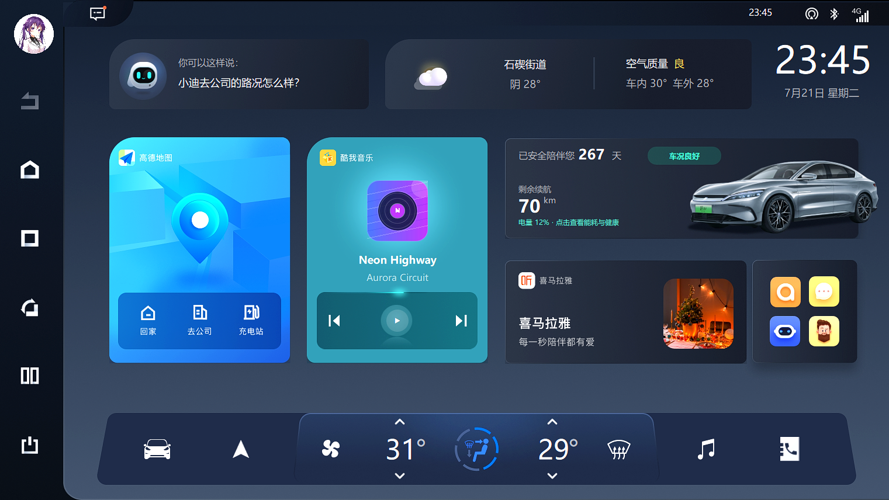
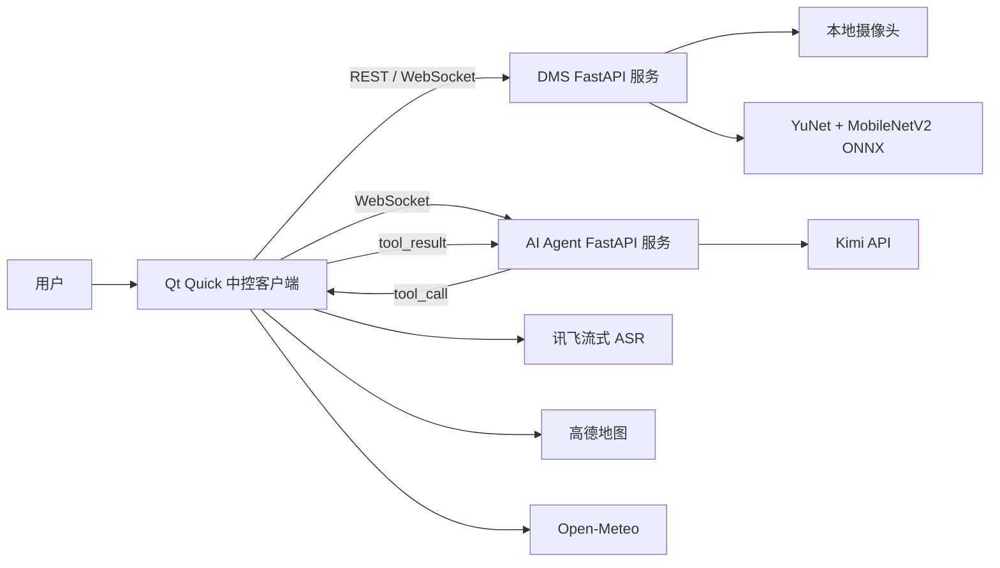
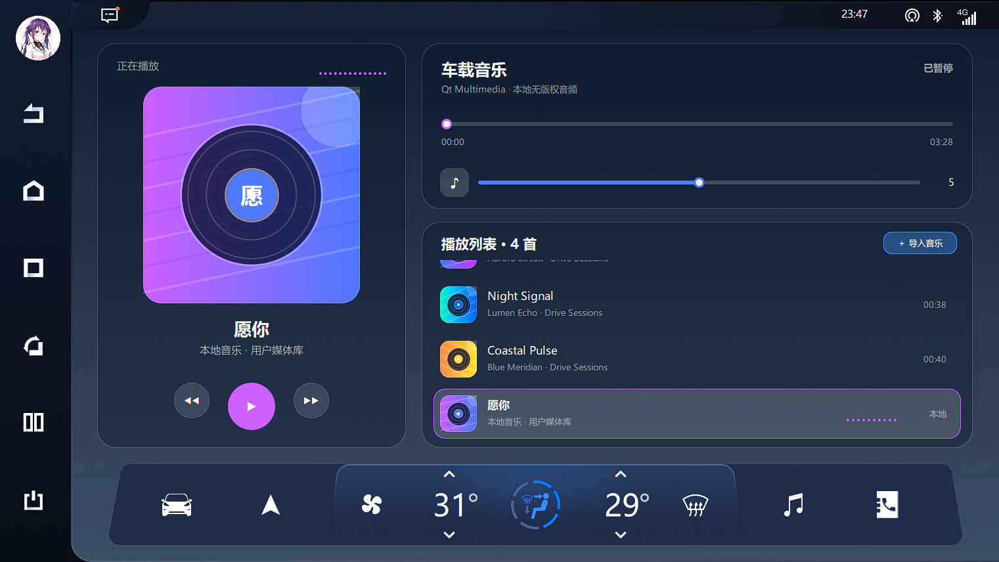
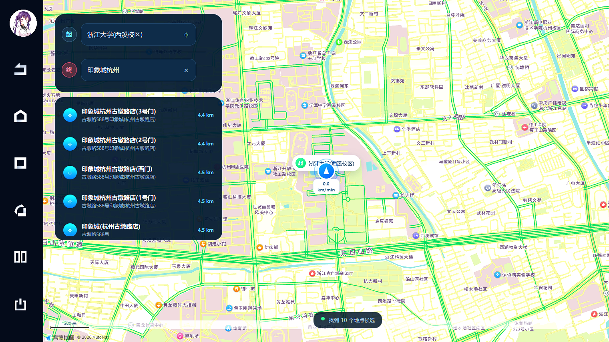
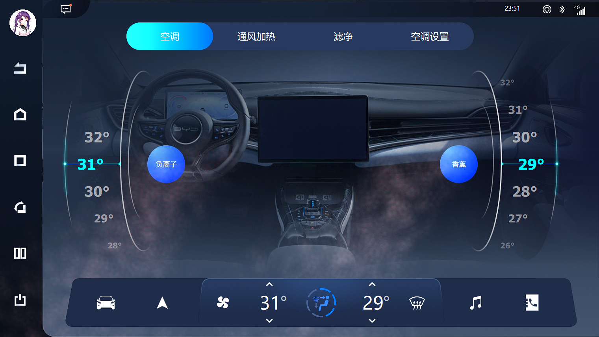

# DrivePilot Cockpit

这是我用 **Qt Quick / QML、C++ 和 Python** 完成的一套智能座舱模拟系统。项目由三个可独立运行的部分组成：Qt 中控客户端、驾驶员疲劳监测服务和 AI Agent 服务。

项目最初基于 B 站公开的 Qt/QML 车载中控教学项目进行二次开发。教学内容提供了早期座舱界面框架和部分基础页面，我在此基础上重新整理工程结构，并继续完成音乐、天气、联系人、视频、矢量画板、模拟导航、驾驶员疲劳监测、讯飞语音识别以及 ReAct 式 AI Agent 等功能。原教学内容和原始素材的相关权利归对应作者，本仓库用于学习和技术展示

Qt 客户端负责界面、媒体、天气、导航、联系人和车辆状态；DMS 服务负责摄像头推理与疲劳状态计算；Agent 服务通过 WebSocket 接收文本或讯飞语音识别结果，再调用 Qt 侧提供的车控接口。整个项目不连接真实车辆总线，所有车控操作都限定在软件模拟状态中。

<p align="center">
  
</p>

## 我实现的内容

### Qt 智能座舱

- 使用固定设计画布配合等比缩放，兼容不同窗口尺寸；
- 完成首页、空调、控制中心、车辆设置、车辆健康、音乐、天气、地图、联系人、视频、计算器和矢量画板；
- 使用 C++ 单例和数据模型管理页面状态，QML 负责显示与交互；
- 使用 SQLite 保存联系人和通话记录，使用 QSettings 保存应用偏好；
- 通过 Qt Network、WebSocket、WebEngine 和 WebChannel 接入天气、地图、DMS 与 Agent；
- 使用高德 JS API 完成地点检索和驾车路线规划，并由 C++ 解析路线轨迹、导航步骤和车辆位置；
- 接入讯飞 WebSocket 流式 ASR，并使用 Qt TextToSpeech 播报疲劳提醒。

### 驾驶员疲劳监测

- 使用 YuNet 检测人脸和五点关键点；
- 使用两个 MobileNetV2 模型分别识别眼睛状态和哈欠状态；
- 将模型导出为 ONNX，并通过 ONNX Runtime 在 CPU 上推理；
- 根据连续闭眼时间、PERCLOS 和哈欠次数计算四级疲劳状态；
- FastAPI 服务独占摄像头，只向 Qt 返回状态和告警，不传输驾驶员画面。

### AI Agent

- Qt 与 FastAPI 通过 WebSocket 保持会话；
- Agent 采用 ReAct 式多轮循环，由 Kimi Tool Calling 选择空调、音乐、页面切换和车辆开关等工具；
- Qt 对工具名和参数再次校验，执行后把结果作为 Observation 回传给 Agent；
- 模型根据上一轮执行结果继续判断，直到给出最终回复或达到最大轮数；
- 未配置云模型时可使用本地规则服务验证通信和工具调用链路；
- API Key 只保存在本地 `.env`，不写入 Qt 资源或仓库。

## 两个重点实现

### ReAct 式车机 Agent

这里不是先生成一份固定计划再交给执行器逐项处理，而是运行“模型判断 → 工具调用 → Qt 执行 → Observation 回传 → 模型继续判断”的闭环。每一轮模型都能看到会话上下文和上一轮真实执行结果，再决定继续调用工具还是结束任务。

Qt 侧只暴露白名单工具，并对参数范围进行二次校验；FastAPI 侧通过 `call_id` 关联工具调用和返回结果，同时处理超时、取消、会话重置和最大执行轮数。界面保留轮次、工具名称、参数和执行结果，用于展示 Agent 的实际运行轨迹，但不会显示模型完整的隐藏推理文本。

```text
用户指令
  → Kimi 判断是否调用工具
  → tool_call
  → Qt 工具桥执行车机操作
  → tool_result / observation
  → Kimi 基于结果进入下一轮
  → final
```

### 模拟导航

导航页面使用 `QWebEngineView` 加载高德 JS API，并通过 `QWebChannel` 在 QML、C++ 与网页 JavaScript 之间同步状态：

- JavaScript 使用 `AMap.AutoComplete` 完成地点建议，使用 `AMap.Driving` 获取驾车路线、道路步骤和完整轨迹；
- `MapController` 解析路线 JSON，按照轨迹点计算累计距离、当前步骤、剩余里程和预计到达时间；
- QML 捕获 W/S 按键，并以 25 ms 定时器按照模拟速度推进或回退路线进度；
- C++ 在相邻轨迹点之间插值车辆经纬度，并根据两点方位角计算车头方向；
- 车辆位置和方向通过 WebChannel 回传给 JavaScript，驱动车辆标记沿高德路线连续移动；
- 用户手动拖动或缩放地图后保留当前视角，车辆仅在接近可视区域边缘时触发最小平移，也可以主动切回跟车视角。

这部分没有接入真实 GPS 或车辆总线，重点是完成一条可交互的“路线规划—轨迹解析—位置插值—地图渲染”模拟链路。

## 系统结构



| 目录 | 技术 | 主要职责 |
|---|---|---|
| [`hmi-client`](hmi-client/) | Qt 6、QML、C++17、CMake | 中控界面、媒体、地图、天气、联系人、Agent 工具执行与 DMS 状态显示 |
| [`dms-backend`](dms-backend/) | FastAPI、OpenCV、ONNX Runtime | 人脸检测、眼睛/哈欠分类、疲劳状态机与摄像头服务 |
| [`agent-backend`](agent-backend/) | FastAPI、WebSocket、Kimi Tool Calling | 会话管理、工具编排、超时和结果回传 |

## 界面截图

<table>
  <tr>
    <td width="50%"><br><b>本地音乐播放</b></td>
    <td width="50%"><br><b>天气详情</b></td>
  </tr>
  <tr>
    <td width="50%"><br><b>地图导航</b></td>
    <td width="50%"><br><b>空调控制</b></td>
  </tr>
  <tr>
    <td colspan="2"><br><b>AI Agent 多轮工具调用</b></td>
  </tr>
</table>

更多页面见 [界面截图](docs/10-interface-gallery.md)。

## 运行环境

- Windows 10 / 11
- Qt 6.9.1，MinGW 64-bit 或 MSVC 2022
- CMake 3.16+
- Python 3.11

Qt 模块：

```text
Quick Multimedia Network WebSockets Sql Concurrent WebEngineQuick WebChannel
```

可选模块：`Positioning`、`TextToSpeech`。

## 启动方式

### 1. DMS 服务

```powershell
cd dms-backend
py -3.11 -m venv .venv
.\.venv\Scripts\Activate.ps1
pip install -r requirements-runtime.txt
python scripts/15_validate_runtime.py
python scripts/16_run_server.py
```

模型、数据集和训练输出不随仓库发布。配置与模型路径见 [`dms-backend/README.md`](dms-backend/README.md)。

### 2. Agent 服务

```powershell
cd agent-backend
py -3.11 -m venv .venv
.\.venv\Scripts\Activate.ps1
pip install -r requirements-dev.txt
Copy-Item .env.example .env
python scripts/run_server.py
```

默认 WebSocket：

```text
ws://127.0.0.1:8770/ws/agent/{session_id}
```

### 3. Qt 客户端

```powershell
cd hmi-client
Copy-Item config.example.json config.json
```

填写本地配置后，使用 Qt Creator 或 CLion 打开 `CMakeLists.txt`，选择 Qt 6.9.1 Kit 构建运行。

## 模型测试结果

| 模型 | 测试集 Macro F1 | 校准阈值 F1 | ONNX CPU P95 |
|---|---:|---:|---:|
| 眼睛状态 MobileNetV2 | 0.9908 | 0.9862 | 3.120 ms |
| 哈欠状态 MobileNetV2 | 0.9814 | 0.9907 | 4.032 ms |

这些结果来自公开数据集测试环境，不代表真实驾驶场景准确率。光照、眼镜、姿态、摄像头位置和个体差异都会影响结果。

## 文档

- [项目概述](docs/01-project-overview.md)
- [需求规格](docs/02-requirements-specification.md)
- [架构设计](docs/03-architecture-design.md)
- [接口协议](docs/05-api-contracts.md)
- [部署说明](docs/06-deployment-guide.md)
- [测试说明](docs/08-testing-and-quality.md)
- [安全与隐私](docs/09-security-and-privacy.md)

## 项目边界

这是一个桌面端智能座舱模拟项目，不接入真实 CAN/LIN 总线，也不具备车规量产、功能安全或医疗诊断能力。DMS 结果只能用于软件功能验证，不能作为真实驾驶安全判断依据。
