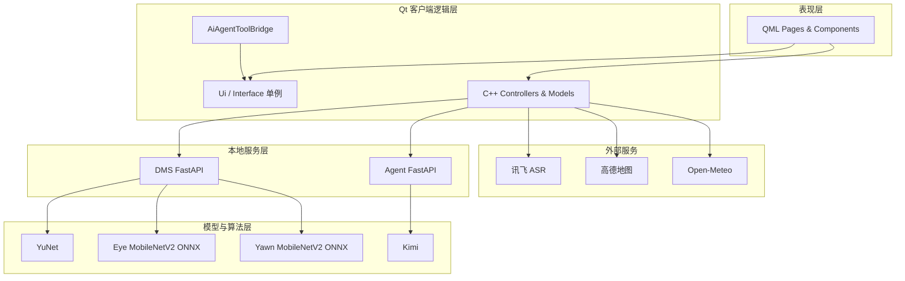
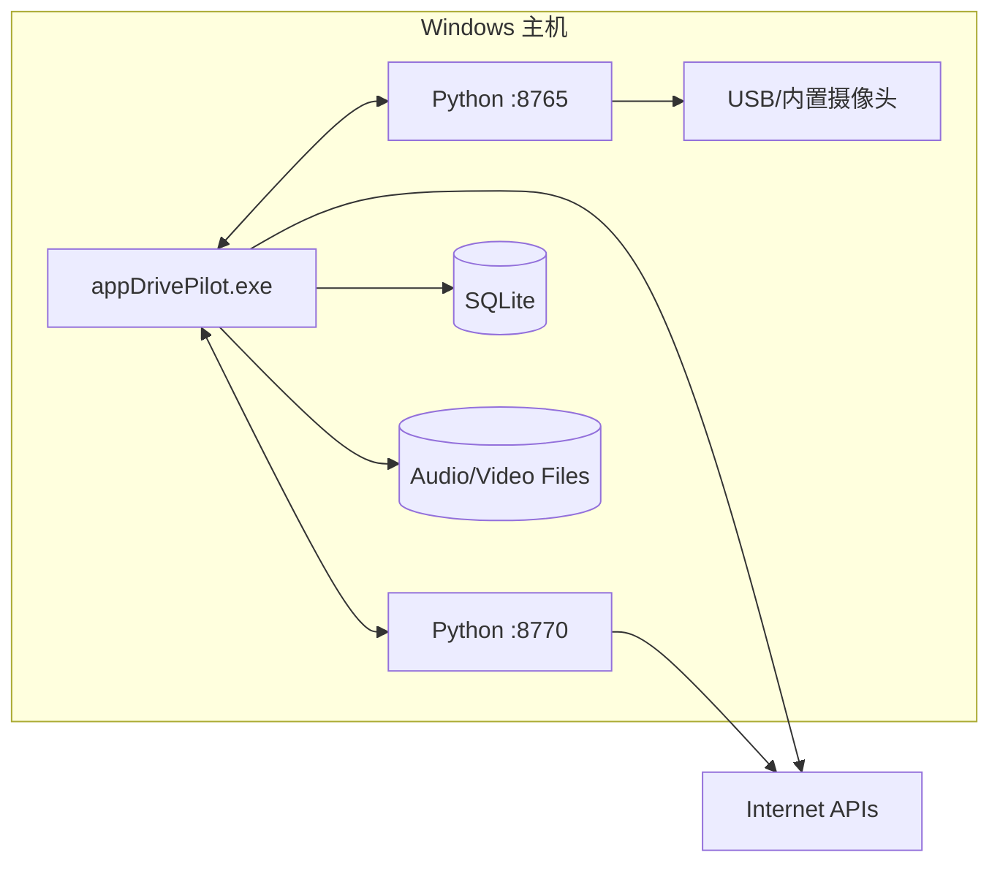

# 03 总体架构设计

## 3.1 架构风格

系统采用“桌面客户端 + 两个本地服务”的松耦合架构：

- Qt 客户端是交互和模拟车控执行端；
- DMS 服务是视觉推理和时间状态端；
- Agent 服务是大模型编排和会话端；
- 外部云服务通过各自适配器接入。

这种设计避免把 PyTorch、OpenCV、大模型 SDK 和密钥全部塞进 Qt 可执行文件。

## 3.2 分层架构



## 3.3 组件职责

### Qt 客户端

| 组件 | 职责 |
|---|---|
| `Main.qml` | 主画布、页面 Loader、全局 Toast、DMS 组件、Agent 工具桥 |
| `Interface`/`Ui` | 页面路由、全局模拟状态、偏好设置 |
| `MusicController` | 播放列表、播放状态、音量 |
| `WeatherController` | 天气请求、城市建议和数据模型 |
| `MapController` | 高德鉴权、地点搜索、路线和 WebChannel |
| `VoiceAssistantController` | 讯飞 ASR、Agent WebSocket、消息模型 |
| `DmsController` | DMS REST/WebSocket、重连、状态和 TTS |
| `ContactController` | SQLite 联系人和通话流程 |
| `VideoController` | 本地视频列表和播放 |
| `VectorStudioController` | 画布元素数据、导入导出和操作 |

### DMS 服务

| 模块 | 职责 |
|---|---|
| `training` | 数据增强、MobileNetV2 迁移学习、训练和指标 |
| `evaluation` | 测试集评估、阈值选择和误判分析 |
| `deployment` | ONNX 导出和一致性检查 |
| `inference` | YuNet、ROI、ONNX 分类和可视化 |
| `fatigue` | PERCLOS、哈欠事件和四级状态机 |
| `service` | 摄像头线程、状态存储、模型生命周期 |
| `api` | REST 与 WebSocket 接口 |

### Agent 服务

| 模块 | 职责 |
|---|---|
| `config` | `.env` 配置和模型参数 |
| `kimi_client` | Kimi 请求、流式/思考内容和工具调用解析 |
| `tools` | 工具 JSON Schema 与展示描述 |
| `session` | 对话历史、待执行工具和取消状态 |
| `agent` | 多轮“模型—工具—观察—继续”循环 |
| `local_agent` | 无云模型时处理少量常用车控指令 |
| `main` | FastAPI、健康检查与 WebSocket 会话 |

## 3.4 运行时部署



## 3.5 关键设计决策

### 决策 1：模型推理放 Python

原因：

- PyTorch/OpenCV/ONNX Runtime 生态成熟；
- 训练和部署代码可复用；
- Qt 不承担模型生命周期和摄像头线程；
- 模型更新不需要重新编译 Qt。

### 决策 2：Agent 编排放 Python

原因：

- 云模型 Key 不进入 Qt；
- 会话、工具循环和重试更易维护；
- 未来可接 RAG、Embedding、Reranker 和向量数据库；
- Qt 只执行白名单工具，保持安全边界。

### 决策 3：Qt 执行工具

大模型不直接操作 QML。Agent 只提出：

```json
{
  "name": "set_ac_temperature",
  "arguments": {"temperature": 22, "zone": "both"}
}
```

Qt 再进行范围检查、调用现有状态接口，并回传真实结果。

### 决策 4：不向 Qt 发送摄像头画面

Qt 只接收数字状态和告警事件，降低隐私风险、序列化开销和 UI 复杂度。

## 3.6 容错设计

- Agent/DMS 后端离线不阻塞 Qt；
- WebSocket 断线后自动重连；
- Agent 工具具有超时和最大轮数；
- DMS 使用 `event_id` 去重；
- Agent 使用 `call_id` 关联结果；
- 配置缺失时给出可读错误或切换到本地规则服务；
- 模型和摄像头异常通过健康接口暴露。
