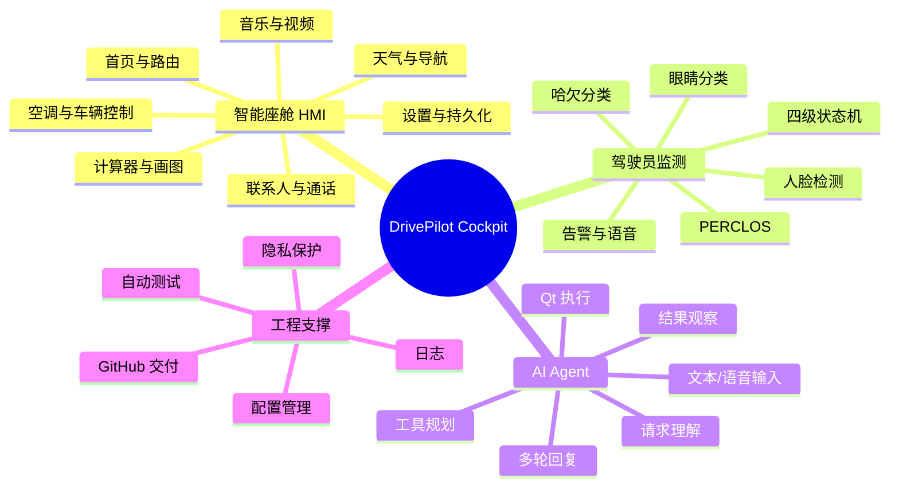
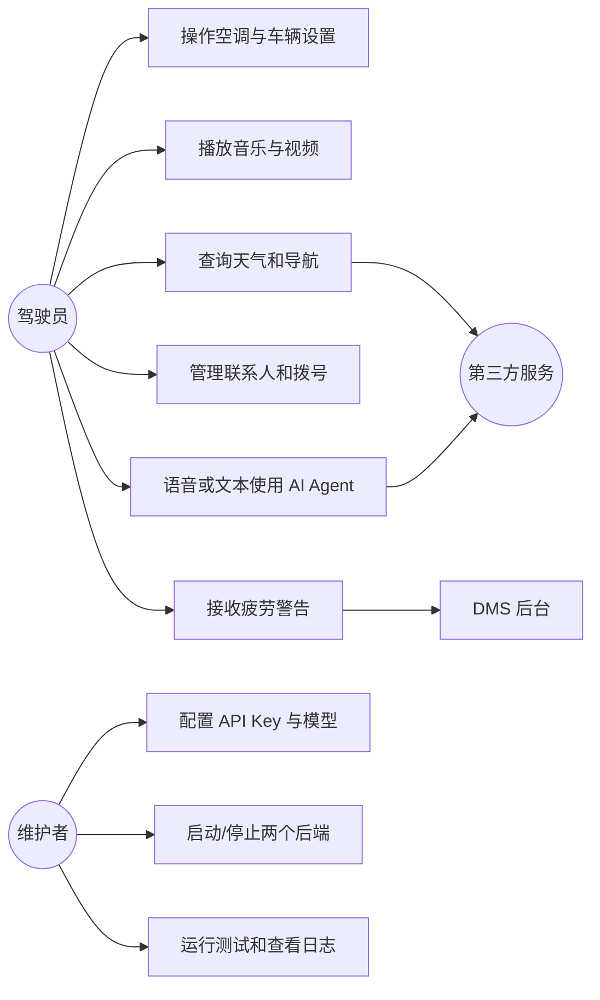
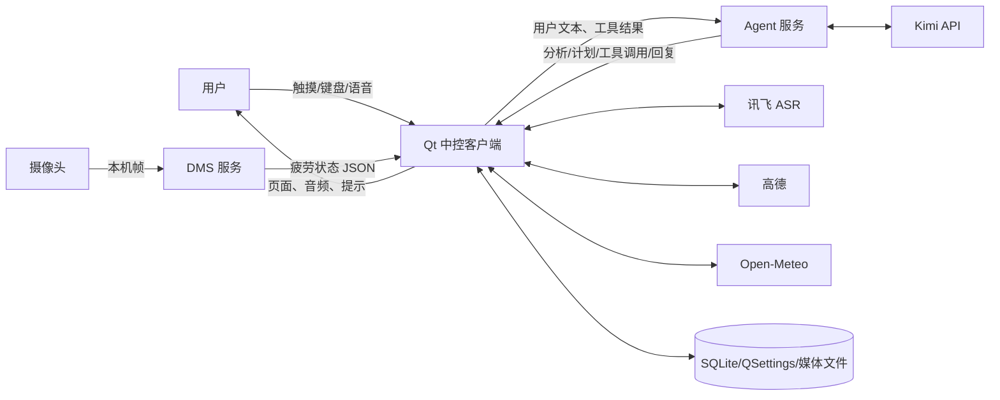
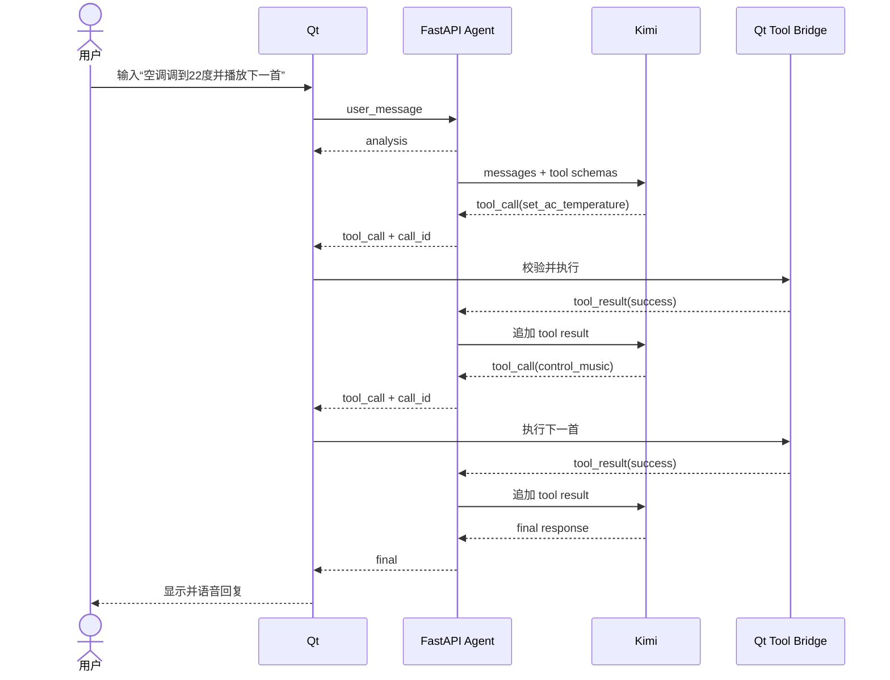
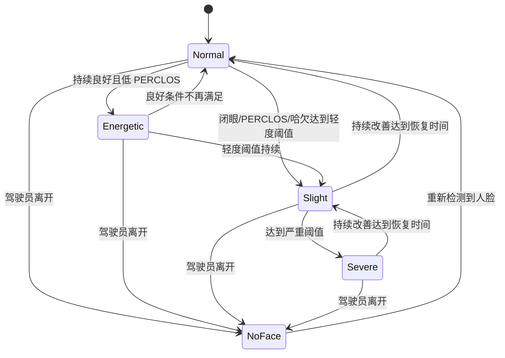
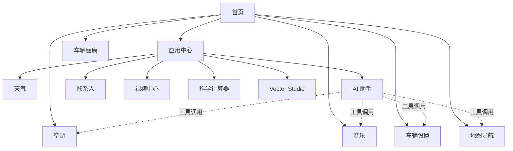

# 04 功能模型与行为模型

## 4.1 功能分解

## 4.2 参与者与用例

## 4.3 系统上下文数据流

## 4.4 Agent 交互时序

## 4.5 DMS 状态模型

状态解释：

| level | 状态 | 图标 | 典型条件 |
|---:|---|---|---|
| 0 | 活力充沛 | 绿色 | 长时间稳定跟踪且 PERCLOS 很低 |
| 1 | 状态正常 | 蓝色 | 未触发疲劳规则 |
| 2 | 略微疲劳 | 黄色 | 闭眼约 1.1 秒、PERCLOS ≥ 0.30 或 2 次哈欠 |
| 3 | 严重疲劳 | 红色 | 闭眼约 2.5 秒、PERCLOS ≥ 0.52 或 3 次哈欠 |

## 4.6 页面导航模型

## 4.7 关键业务规则

1. Agent 工具名必须位于后端白名单；
2. Qt 对温度、风量、音量和页面名再次校验；
3. DMS 告警只在 `event_id` 增加时提醒；
4. 普通眨眼不应直接判为疲劳，必须通过连续时间状态机；
5. 无人脸时不增加疲劳指标，长时间无人脸清空窗口；
6. 关闭疲劳提醒后隐藏图标、关闭告警、停止通信并请求后端释放摄像头；
7. API Key 只存在未提交的本地配置中。
